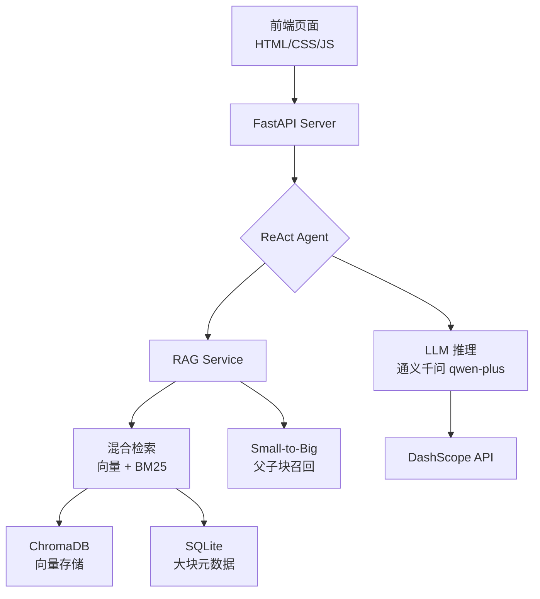

# RAG 智能问答系统 v2.0

> 基于 ReAct Agent 的智能问答系统，支持知识库混合检索、文档上传解析、多轮对话及流式 SSE 响应。
>
> **技术栈**：FastAPI + ChromaDB + DashScope (通义千问) + SQLite + 原生 HTML/CSS/JS
>
> 本项目使用 AI 编码工具（Codex / GPT）辅助完成，从架构设计到前后端实现均为端到端独立开发。

---

## 架构总览



### 项目结构

```text
project/
  main.py                      # FastAPI 入口
  requirements.txt
  .env.example
  api/
    routes.py                  # RAG 检索、文档管理 API
  apps/
    customer_service/
      routes.py                # 客服对话、认证、流式 SSE API
  domain/
    customer_service/
      agent.py                 # ReAct Agent 核心逻辑
      prompts.py               # LLM 提示词模板
    retrieval/
      hybrid_search.py         # BM25 + 向量混合检索 & 重排序
  infrastructure/
    database.py                # SQLite 用户/对话/大块持久化
    models.py                  # 数据模型
    rag/
      embedding.py             # DashScope 文本嵌入
      vector_store.py          # ChromaDB 向量存储 CRUD
  llm/
    client.py                  # LLM 客户端（含流式）
  services/
    rag_service.py             # 文档摄入 & 上下文召回编排
  tools/
    base.py                    # Agent Tool 基类
    faq_search.py              # FAQ 检索 Tool
  utils/
    auth.py                    # JWT 认证 & 密码哈希
    chunker.py                 # Small-to-Big 父子块切分
    conversation.py            # 会话管理
    document_parser.py         # 多格式文档解析（PDF/DOCX/TXT/MD）
  static/
    index.html                 # 前端登录/对话界面
    style.css
    app.js
```

---

## 核心特性

### 1. ReAct Agent 智能问答

- 问题自动重写（Question Rewriting），将口语化问题优化为检索友好的查询
- 工具调用（Tool Use）架构：Agent 自主判断是否调用 FAQ 检索工具
- 结构化输出：思考过程（Reasoning）、执行动作（Action）、最终回复（Reply）三段式
- 对话历史感知，支持多轮上下文理解
- LLM 自动生成会话标题

### 2. Small-to-Big 父子块检索

- **子块**（200-300 tokens）：高精度向量检索，快速命中相关段落
- **父块**（1500-2000 tokens）：召回子块对应的完整上下文段落，保留文档结构
- 子块存入 ChromaDB 向量库，父块元数据存入 SQLite，两阶段检索确保召回质量

### 3. 混合检索 & 重排序

- 向量检索（ChromaDB + HNSW 索引）：语义相似度匹配
- 关键词检索（BM25）：精确词汇匹配，互补语义检索的不足
- RRF（Reciprocal Rank Fusion）融合排序，取长补短

### 4. 文档管理

- 支持 PDF、DOCX、TXT、Markdown 等格式上传
- 基于 `unstructured` 库的智能文档解析
- 文档的增、删、查、状态追踪 API

### 5. 前端交互

- 登录/注册（JWT 认证），支持匿名体验模式
- 左侧会话列表，右侧对话区域，类 ChatGPT 布局
- 流式 SSE 响应，逐字输出
- 消息反馈（点赞/点踩）
- 检索来源可视化展示

---

## 快速开始

### 环境要求

- Python 3.10+
- DashScope API Key（[阿里云百炼平台](https://bailian.console.aliyun.com/) 申请）

### 安装

```bash
git clone https://github.com/w-q-x/rag-intelligent-qa-system.git
cd rag-intelligent-qa-system

pip install -r requirements.txt
cp .env.example .env
```

编辑 `.env`，填入你的 DashScope API Key：

```ini
MODEL_API_KEY=sk-xxxxxxxxxxxxxxxx
EMBEDDING_API_KEY=sk-xxxxxxxxxxxxxxxx
```

### 运行

```bash
python main.py
```

服务启动后：

- 前端页面：[http://127.0.0.1:8080/static/index.html](http://127.0.0.1:8080/static/index.html)

### 快速体验

1. 打开前端，点击"跳过登录"进入体验模式
2. 上传一份 PDF 或 DOCX 文档到知识库
3. 在对话界面提问文档相关内容，Agent 会自动检索并回答
4. 查看检索来源，验证答案依据

---

## API 概览

| 方法 | 路径 | 说明 |
|------|------|------|
| POST | /api/v1/auth/register | 用户注册 |
| POST | /api/v1/auth/login | 用户登录 |
| GET | /api/v1/auth/me | 获取当前用户 |
| POST | /api/v1/chat | 客服对话（非流式） |
| POST | /api/v1/chat/stream | 客服对话（SSE 流式） |
| GET | /api/v1/conversations | 会话列表 |
| GET | /api/v1/conversations/:id | 会话详情 |
| DELETE | /api/v1/conversations/:id | 删除会话 |
| PUT | /api/v1/conversations/:id/title | 更新会话标题 |
| POST | /api/v1/messages/:id/feedback | 消息反馈 |
| POST | /rag/search | 向量检索 |
| POST | /rag/search/summary | 检索 + LLM 摘要 |
| POST | /rag/documents/upload | 上传文档 |
| GET | /rag/documents | 文档列表 |
| DELETE | /rag/documents/:id | 删除文档 |

完整接口文档请访问 Swagger UI：[http://localhost:8080/docs](http://localhost:8080/docs)

---

## 配置说明

所有配置通过环境变量（`.env` 文件）管理，详见 `.env.example`。核心配置项：

| 变量 | 说明 | 默认值 |
|------|------|--------|
| `MODEL_API_KEY` | 大模型 API Key | — |
| `EMBEDDING_API_KEY` | 嵌入模型 API Key | — |
| `MODEL_MODEL_NAME` | 大模型名称 | qwen-plus |
| `EMBEDDING_MODEL_NAME` | 嵌入模型名称 | text-embedding-v1 |
| `JWT_SECRET_KEY` | JWT 密钥 | 自动生成 |
| `API_PORT` | 服务端口 | 8080 |

---

## 技术选型说明

| 模块 | 技术 | 原因 |
|------|------|------|
| LLM | 通义千问 qwen-plus (DashScope) | 性价比高，中文理解优秀 |
| 嵌入 | text-embedding-v1 (DashScope) | 1024 维，中文语义表征好 |
| 向量库 | ChromaDB + HNSW | 轻量级，零配置，适合 demo |
| 关键词检索 | BM25 (rank-bm25) | 经典算法，精确匹配互补 |
| 文档解析 | unstructured | 支持 20+ 格式，解析质量高 |
| 后端框架 | FastAPI | 高性能，自动 Swagger 文档 |
| 数据库 | SQLite | 零配置，适合单机部署 |
| 前端 | 原生 HTML/CSS/JS | 无框架依赖，部署简单 |

## License

MIT